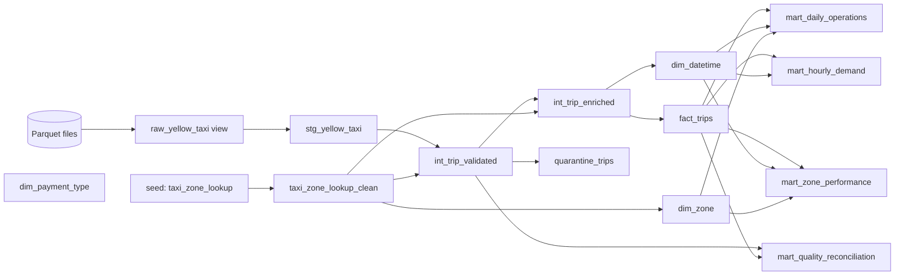

# Data lineage

```mermaid
flowchart LR
    P[(Parquet files)] --> R[raw_yellow_taxi view]
    Z[seed: taxi_zone_lookup] --> ZC[taxi_zone_lookup_clean]
    R --> S[stg_yellow_taxi]
    S --> V[int_trip_validated]
    ZC --> V
    V --> E[int_trip_enriched]
    ZC --> E
    V --> Q[quarantine_trips]
    E --> F[fact_trips]
    E --> DT[dim_datetime]
    ZC --> DZ[dim_zone]
    PT[dim_payment_type]
    F --> M1[mart_daily_operations]
    F --> M2[mart_hourly_demand]
    F --> M3[mart_zone_performance]
    DT --> M1
    DT --> M2
    DT --> M3
    DZ --> M1
    DZ --> M3
    V --> QR[mart_quality_reconciliation]
    F --> QR
```

`dbt docs generate` produces the browsable, authoritative lineage graph from the code.
